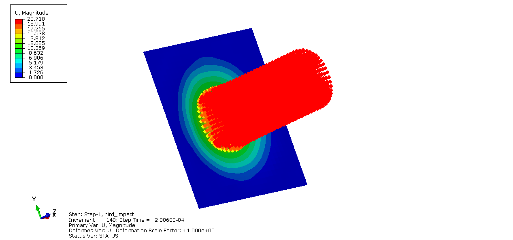
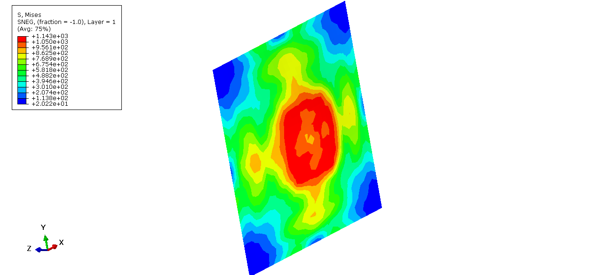

# Impact Analysis
**Numerical Assessment of Bird Impact on Composite Laminates**

A finite element study of low velocity bird impact on satin weave composite laminates using Abaqus. The project evaluates chosen numerical method against experimental results and standards.
## NOTE: Python scripts and plots are confidential since the journal is under publication stage
## Overview
Aircraft components are prone to soft body impacts based on incidents sich as pebbles, hailstones, gunshots and also bird strikes which have been noticed in recent days. Bird strike can lead to severe local damage on lightweight structure some time even leading to disasters. This work mainly focusses on evaluating strength of the laminates under constant velocity varying bird mass.

Solver : Abaqus explicit dynamics

Pre and post processing : Python 

Application: Composite mechanics for aerospace structures

## Modelling for analysis
Smooth particle hydrodynamics method used to simulate bird and plate interaction. The bird is modelled as a cylinder with varying masses and maintaining constant standard velocity as per aviation standards. Composite plate is rectangular laminate composed of Carbon and Kevlar materials with varied compositions.  Multiscale modellling is used to create composite laminates of 2 and 5 harness satins. Pyhton script was developed to create input files and to post process the result and to plot the curves. Performed a total of 32 different trails on all possible combinations of bird mass and laminate sandwich.

## Results
### Model setup

*Imopact analysis model showing contact between bird and plate along Z-direction .*

### Stress result

*Stress distribution along the plate area at maximum impact force.*

### Impact Sequence

*Impact sequence of bird on plate.*

## Summary
1.Performed numerical analysis captured impact dynamics response for varying mass.

2.Deformation, contact force, kinetic energy curves were plotted and compared against experimental results.

3.Higher the mass higher the damage on the material also implies with velocity.

4.Observed better response of carbon-kevlar 5HS combination amongst all other combinations.
